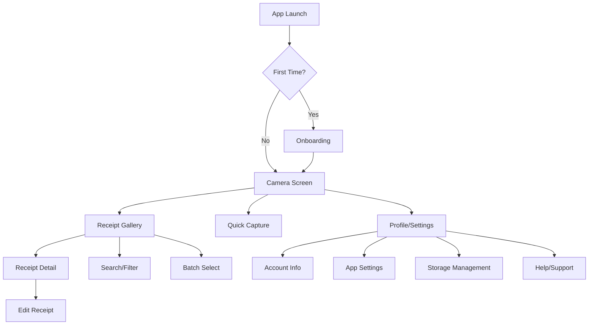
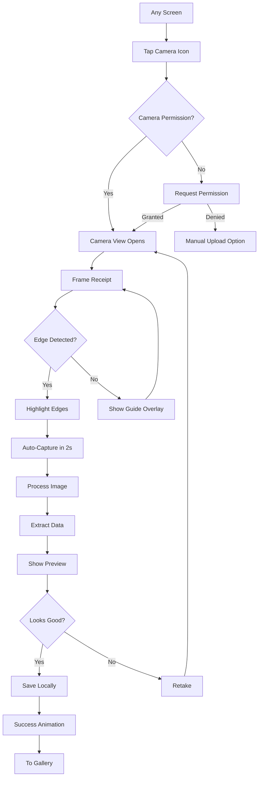
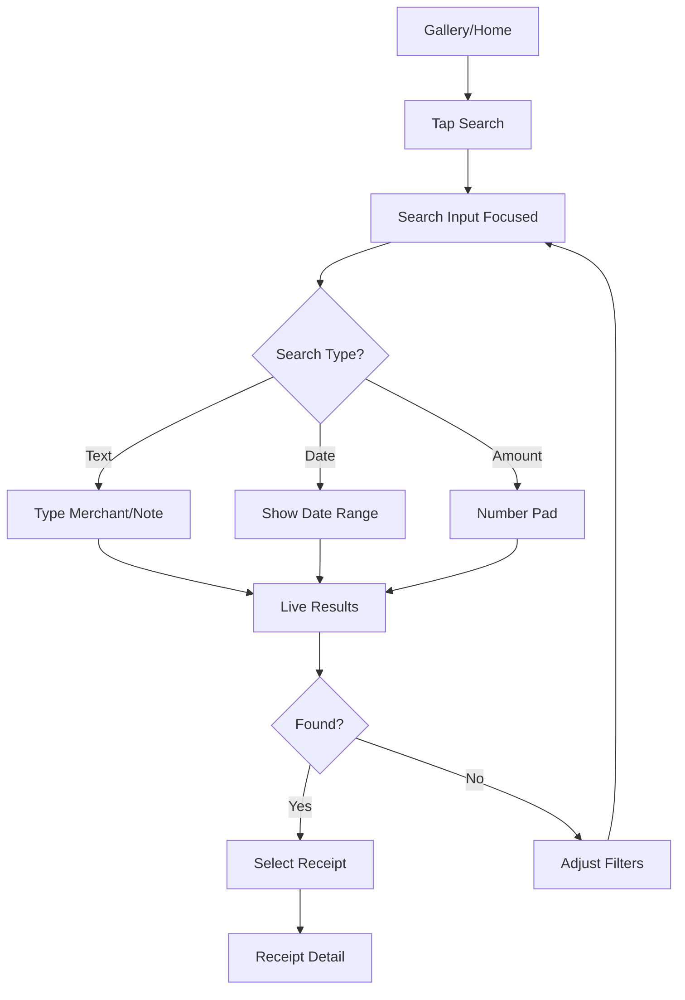
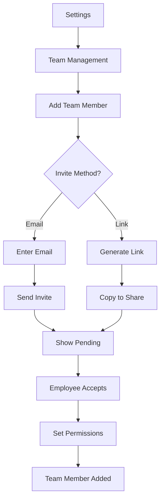

# Receipt Vault Pro UI/UX Specification

This document defines the user experience goals, information architecture, user flows, and visual design specifications for Receipt Vault Pro's user interface. It serves as the foundation for visual design and frontend development, ensuring a cohesive and user-centered experience.

### Overall UX Goals & Principles

### Target User Personas

- **Sarah, Small Business Owner:** Runs a 10-person marketing agency, needs quick expense tracking for tax deductions. Tech-comfortable but time-poor. Uses iPhone primarily, laptop for monthly reconciliation.
- **Mike, Field Sales Rep:** Constantly on the road, accumulates 20-30 receipts weekly. Needs instant capture without breaking stride. Android user, minimal patience for complex apps.
- **Elena, Office Manager:** Manages expenses for 5 employees, needs oversight and organization. Desktop-first user who reviews and categorizes receipts in batches.

### Usability Goals

- Ease of learning: New users can capture and save their first receipt within 30 seconds
- Efficiency of use: Receipt capture completed in under 10 seconds from app open
- Error prevention: Smart edge detection reduces failed captures by 90%
- Memorability: Core features accessible within 2 taps from any screen
- Satisfaction: Delightful micro-interactions make expense tracking feel less like a chore

### Design Principles

1. **Camera-First Architecture** - The camera is the hero feature, always one tap away
2. **Progressive Disclosure** - Start simple, reveal complexity only when users need it
3. **Platform Native Feel** - Honor iOS/Android conventions while maintaining brand consistency
4. **Forgiving Interface** - Easy to undo, retry, or correct any action
5. **Accessible by Default** - WCAG 2.1 AA compliance built into every component

### Change Log

| Date | Version | Description | Author |
| :--- | :------ | :---------- | :----- |
| 2024-01-24 | 1.0 | Initial UI/UX specification | Sally (UX Expert) |

## Information Architecture (IA)

### Site Map / Screen Inventory

### Navigation Structure

**Primary Navigation:** Bottom tab bar (mobile) / Side nav (tablet/desktop)
- Camera (center, prominent)
- Gallery (left)
- Search (right)
- Profile (far right)

**Secondary Navigation:** Contextual actions in top bar
- Batch operations when selecting multiple receipts
- Filter/sort options in gallery view
- Save/cancel in edit modes

**Breadcrumb Strategy:** Mobile: Back button only. Tablet/Desktop: Full breadcrumb trail for nested views

## User Flows

### Camera Capture Flow

**User Goal:** Quickly capture a receipt with minimal friction

**Entry Points:** App launch (default), Camera tab, FAB on any screen

**Success Criteria:** Receipt captured, edges detected, image saved locally within 10 seconds

#### Flow Diagram

**Edge Cases & Error Handling:**

- Poor lighting: Show brightness adjustment slider
- Multiple receipts: Prompt to capture separately
- Blurry image: Shake animation with "Hold steady" message
- Storage full: Immediate warning with cleanup option

**Notes:** Auto-capture can be disabled in settings for users who prefer manual control

### Receipt Search Flow

**User Goal:** Find specific receipts quickly by date, amount, or merchant

**Entry Points:** Search tab, search icon in gallery, widget shortcut

**Success Criteria:** Target receipt found in under 3 taps/10 seconds

#### Flow Diagram

**Edge Cases & Error Handling:**

- No results: Suggest broadening search, check filters
- Slow search: Show loading state after 0.5s
- Offline search: Local data only indicator

### Multi-User Setup Flow

**User Goal:** Business owner adds employee to share receipt access

**Entry Points:** Settings > Team Management, Onboarding prompt

**Success Criteria:** Employee successfully added and can submit receipts

#### Flow Diagram

**Edge Cases & Error Handling:**

- Invalid email: Inline validation
- Expired invite: Resend option
- Permission conflicts: Clear explanation of each permission

## Wireframes & Mockups

**Primary Design Files:** [Figma Link - to be created]

### Key Screen Layouts

#### Camera Capture Screen

**Purpose:** Primary receipt capture interface

**Key Elements:**
- Full-screen camera view with subtle vignette
- Floating capture button (bottom center, 80px)
- Edge detection overlay (animated green borders)
- Top bar: Flash, Gallery shortcut, Close
- Auto-capture countdown indicator

**Interaction Notes:** 
- Pinch to zoom
- Tap to focus
- Swipe up for recent captures
- Long press for manual mode

**Design File Reference:** [Camera_Capture_Flow]

#### Receipt Gallery

**Purpose:** Browse and manage all captured receipts

**Key Elements:**
- Grid view (3 columns mobile, 4-6 tablet/desktop)
- Floating Action Button for camera
- Search bar (collapsible on scroll)
- Filter chips (Date, Amount, Category)
- Sync status indicator

**Interaction Notes:**
- Pull to refresh
- Long press for multi-select
- Swipe left/right between view modes
- Pinch to adjust grid size

**Design File Reference:** [Gallery_Views]

#### Receipt Detail View

**Purpose:** View and edit individual receipt information

**Key Elements:**
- Full receipt image (zoomable)
- Extracted data fields below
- Edit button (top right)
- Share/Export options
- Delete (with confirmation)

**Interaction Notes:**
- Swipe down to dismiss
- Double tap to zoom
- Swipe left/right for next/previous

**Design File Reference:** [Receipt_Detail]

## Component Library / Design System

**Design System Approach:** Custom design system built on React Native's platform primitives, with careful attention to platform-specific patterns

### Core Components

#### Navigation Bar

**Purpose:** Primary navigation and app-wide actions

**Variants:** Bottom tabs (mobile), Side rail (tablet), Top bar (desktop)

**States:** Default, Active, Disabled, Badge

**Usage Guidelines:**
- Camera always center on mobile
- Maintain muscle memory across platforms
- Badge for sync status only

#### Capture Button

**Purpose:** Primary action to capture receipts

**Variants:** Large (camera screen), Medium (FAB), Small (inline)

**States:** Default, Pressed, Disabled, Processing

**Usage Guidelines:**
- Always most prominent element
- Consistent placement across screens
- Animate on press for feedback

#### Receipt Card

**Purpose:** Display receipt in gallery views

**Variants:** Grid view, List view, Compact

**States:** Default, Selected, Syncing, Error

**Usage Guidelines:**
- Show merchant and amount prominently
- Date in consistent position
- Visual indicator for sync status

#### Form Input

**Purpose:** Data entry for receipt details

**Variants:** Text, Number, Date, Dropdown

**States:** Empty, Focused, Filled, Error, Disabled

**Usage Guidelines:**
- Float labels for space efficiency
- Clear error messages below
- Auto-advance where logical

## Branding & Style Guide

### Visual Identity

**Brand Guidelines:** Clean, professional, trustworthy

### Color Palette

| Color Type    | Hex Code  | Usage                            |
| :------------ | :-------- | :------------------------------- |
| **Primary**   | #2563EB   | Primary actions, active states   |
| **Secondary** | #64748B   | Secondary buttons, inactive tabs |
| **Accent**    | #10B981   | Success states, edge detection   |
| **Success**   | #10B981   | Successful capture, sync complete|
| **Warning**   | #F59E0B   | Storage warnings, sync issues    |
| **Error**     | #EF4444   | Failed captures, errors          |
| **Neutral**   | #F8FAFC   | Backgrounds                      |
|               | #1E293B   | Primary text                     |
|               | #64748B   | Secondary text                   |
|               | #E2E8F0   | Borders, dividers                |

### Typography

**Font Families:**
- **Primary:** System Default (SF Pro iOS, Roboto Android, -apple-system Web)
- **Secondary:** None (use weights for hierarchy)
- **Monospace:** System Mono (for amounts)

**Type Scale:**
| Element | Size | Weight | Line Height |
|:--------|:-----|:-------|:------------|
| H1 | 32px | 700 | 40px |
| H2 | 24px | 600 | 32px |
| H3 | 20px | 600 | 28px |
| Body | 16px | 400 | 24px |
| Small | 14px | 400 | 20px |

### Iconography

**Icon Library:** React Native Vector Icons (Ionicons for consistency)

**Usage Guidelines:**
- Outline style for inactive states
- Filled for active/selected
- Consistent 24px base size
- Always pair with labels for accessibility

### Spacing & Layout

**Grid System:** 8px base unit

**Spacing Scale:** 
- xs: 4px
- sm: 8px
- md: 16px
- lg: 24px
- xl: 32px
- 2xl: 48px

## Accessibility Requirements

### Compliance Target

**Standard:** WCAG 2.1 Level AA

### Key Requirements

**Visual:**
- Color contrast ratios: 4.5:1 for normal text, 3:1 for large text
- Focus indicators: 3px outline with 2px offset
- Text sizing: Support 200% zoom without horizontal scroll

**Interaction:**
- Keyboard navigation: Full app navigable via external keyboard
- Screen reader support: VoiceOver (iOS) and TalkBack (Android) tested
- Touch targets: Minimum 44x44pt with 8pt spacing

**Content:**
- Alternative text: Descriptive text for all receipt images
- Heading structure: Logical h1-h3 hierarchy
- Form labels: Clear labels, error messages announced

### Testing Strategy

- Automated accessibility testing in CI/CD
- Manual testing with screen readers monthly
- User testing with disabled users quarterly

## Responsiveness Strategy

### Breakpoints

| Breakpoint | Min Width | Max Width | Target Devices        |
| :--------- | :-------- | :-------- | :-------------------- |
| Mobile     | 320px     | 767px     | Phones                |
| Tablet     | 768px     | 1023px    | Tablets, small laptop |
| Desktop    | 1024px    | 1439px    | Laptops, desktops     |
| Wide       | 1440px    | -         | Large displays        |

### Adaptation Patterns

**Layout Changes:** 
- Mobile: Single column, bottom navigation
- Tablet: Two column with side navigation
- Desktop: Three column with enhanced detail view

**Navigation Changes:**
- Mobile: Bottom tabs
- Tablet: Side rail
- Desktop: Side rail + top bar

**Content Priority:**
- Mobile: Camera and recent receipts
- Tablet: Gallery with preview
- Desktop: Full dashboard view

**Interaction Changes:**
- Mobile: Touch-first, gestures
- Tablet: Touch + hover states
- Desktop: Mouse-first, keyboard shortcuts

## Animation & Micro-interactions

### Motion Principles

1. **Purpose-driven**: Every animation has functional value
2. **Snappy**: 200-300ms for most transitions
3. **Natural**: Follow platform physics
4. **Accessible**: Respect reduce motion preferences

### Key Animations

- **Camera Capture**: Shutter animation + shrink to gallery (Duration: 400ms, Easing: ease-out)
- **Edge Detection**: Pulse animation on corners (Duration: 1000ms, Easing: ease-in-out)
- **Success State**: Check mark draw + fade (Duration: 600ms, Easing: ease-out)
- **Page Transitions**: Slide + fade (Duration: 250ms, Easing: ease-in-out)
- **Loading States**: Skeleton screens with shimmer (Duration: 1500ms, Easing: linear)

## Performance Considerations

### Performance Goals

- **Page Load:** < 2 seconds on 3G
- **Interaction Response:** < 100ms for touch feedback
- **Animation FPS:** Consistent 60fps

### Design Strategies

- Lazy load images in gallery with progressive loading
- Virtualized lists for large receipt collections
- Skeleton screens during data fetching
- Optimistic UI updates for all user actions
- Image compression with quality previews

## Next Steps

### Immediate Actions

1. Create high-fidelity mockups in Figma for key screens
2. Prototype camera capture flow for user testing
3. Develop component library documentation

### Design Handoff Checklist

- [x] All user flows documented
- [x] Component inventory complete
- [x] Accessibility requirements defined
- [x] Responsive strategy clear
- [x] Brand guidelines incorporated
- [x] Performance goals established

## Checklist Results

*To be completed after UX checklist validation*